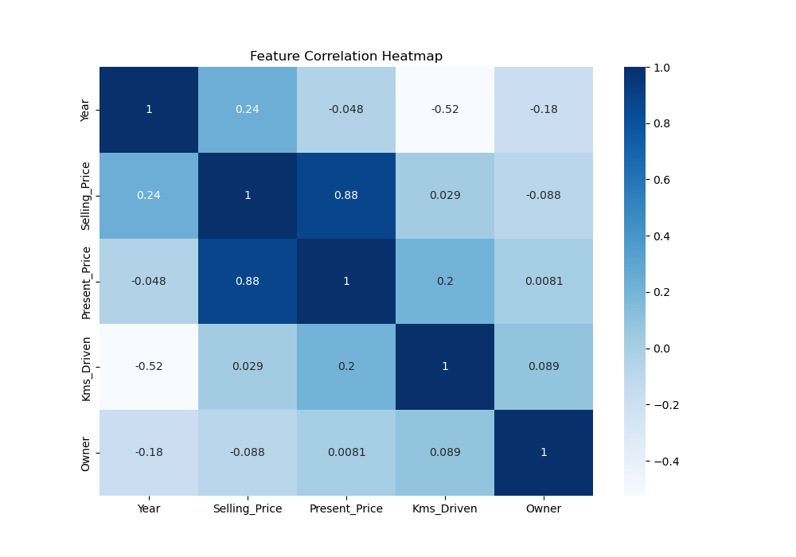
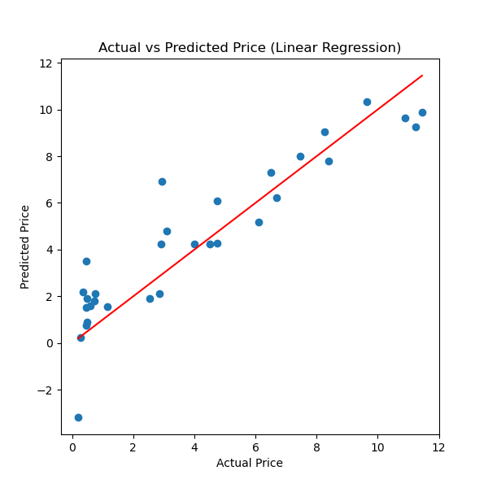
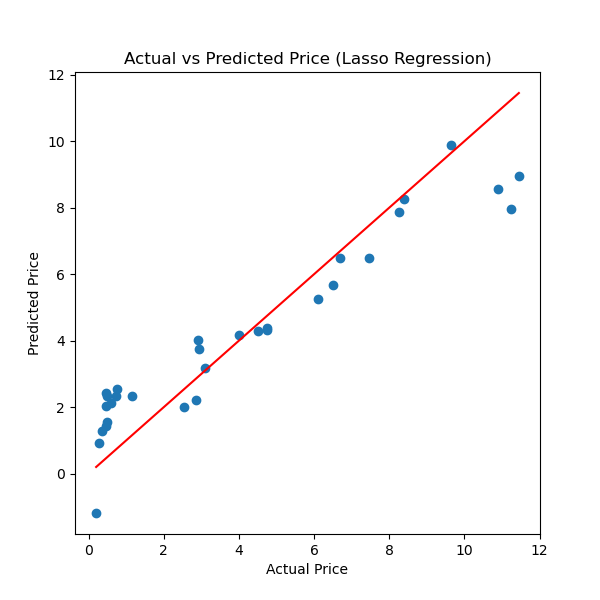
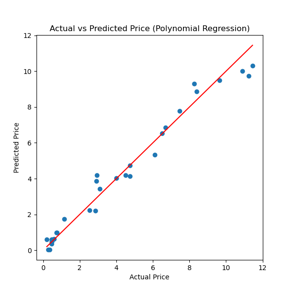
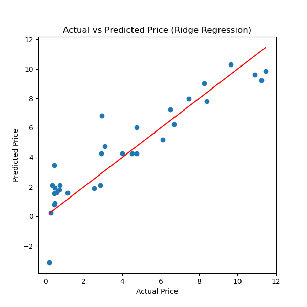
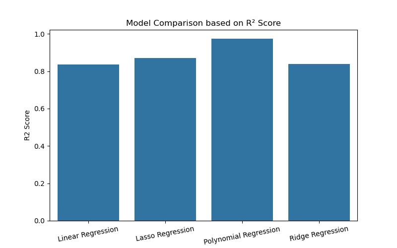

# Car Price Prediction using Machine Learning

This project predicts car selling prices using multiple Machine Learning regression models.

## Project Overview

The goal of this project is to build and compare different regression models to predict car selling prices based on several car features.

The project includes:
- Data preprocessing
- Exploratory Data Analysis (EDA)
- Feature encoding
- Model training
- Model evaluation
- Data visualization

---

# Dataset

The dataset contains information about used cars including:

- Car Name
- Year
- Selling Price
- Present Price
- Kms Driven
- Fuel Type
- Seller Type
- Transmission
- Owner

---

# Technologies Used

- Python
- Pandas
- Matplotlib
- Seaborn
- Scikit-learn

---

# Machine Learning Models

The following regression models were implemented and compared:

1. Linear Regression
2. Lasso Regression
3. Polynomial Regression
4. Ridge Regression

---

# Data Preprocessing

The following preprocessing steps were performed:

- Checking missing values
- Statistical analysis
- Encoding categorical variables
- Splitting data into training and testing sets

---

# Model Evaluation Metrics

The models were evaluated using:

- R² Score
- Mean Squared Error (MSE)

---

# Results Visualization

The project includes visualizations for:

- Actual vs Predicted Prices
- Models Comparison using R² Score

---

# Project Structure

```bash
Car-Price-Prediction/
│
├── data/
│   └── car data.csv
│
├── notebook/
│   └── car_price_prediction.ipynb
│
├── src/
│   └── car_price_prediction.py
│
├── images/
│   ├── feature_correlation.png
│   ├── linear_regression.png
│   ├── lasso_regression.png
│   ├── polynomial_regression.png
│   ├── ridge_regression.png
│   └── models_comparison.png
│
├── requirements.txt
├── README.md
└── .gitignore
```

---

# Results

## Correlation Heatmap



## Linear Regression



---

## Lasso Regression



---

## Polynomial Regression



---

## Ridge Regression



---

## Models Comparison



---

# Conclusion

In this project, multiple Machine Learning regression models were implemented to predict car selling prices.

Among all models, Polynomial Regression achieved the best performance because it captured non-linear relationships more effectively.

This project demonstrates a complete Machine Learning workflow including:
- Data preprocessing
- Data visualization
- Model training
- Model evaluation
- Model comparison

---

# How to Run

Install dependencies:

```bash
pip install -r requirements.txt
```

Run the project:

```bash
python src/car_price_prediction.py
```

---

# Future Improvements

- Add more regression models
- Hyperparameter tuning
- Feature engineering
- Deploy the model using Streamlit